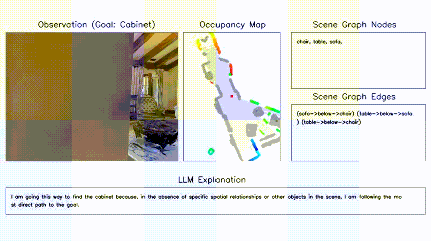

# SG-Nav: Online 3D Scene Graph Prompting for LLM-based Zero-shot Object Navigation
### [Paper](https://arxiv.org/abs/2410.08189) | [Project Page](https://bagh2178.github.io/SG-Nav/) | [Video](https://cloud.tsinghua.edu.cn/f/ae050a060d624be4bc5d/?dl=1)

> SG-Nav: Online 3D Scene Graph Prompting for LLM-based Zero-shot Object Navigation  
> [Hang Yin](https://bagh2178.github.io/)*, [Xiuwei Xu](https://xuxw98.github.io/)\* $^\dagger$, [Zhenyu Wu](https://gary3410.github.io/), [Jie Zhou](https://scholar.google.com/citations?user=6a79aPwAAAAJ&hl=en&authuser=1), [Jiwen Lu](http://ivg.au.tsinghua.edu.cn/Jiwen_Lu/)$^\ddagger$  

\* Equal contribution $\dagger$ Project leader $\ddagger$ Corresponding author


We propose a <b>zero-shot</b> object-goal navigation framework by constructing an online 3D scene graph to prompt LLMs. Our method can be directly applied to different kinds of scenes and categories <b>without training</b>. [中文解读](https://zhuanlan.zhihu.com/p/909651478).


## News
- [2024/09/26]: SG-Nav is accepted to NeurIPS 2024!


## Demo
### Scene1:


### Scene2:


Demos are a little bit large; please wait a moment to load them. Welcome to the home page for more complete demos and detailed introductions.


## Method 

Method Pipeline:


## Getting Started
For environment setup and dataset preparation, please follow:
* [Installation](./docs/installation.md)

For evaluation, please follow:
* [Evaluation](./docs/run.md)


## Citation
```
@article{yin2024sgnav, 
      title={SG-Nav: Online 3D Scene Graph Prompting for LLM-based Zero-shot Object Navigation}, 
      author={Hang Yin and Xiuwei Xu and Zhenyu Wu and Jie Zhou and Jiwen Lu},
      journal={arXiv preprint arXiv:2410.08189},
      year={2024}
}
```
